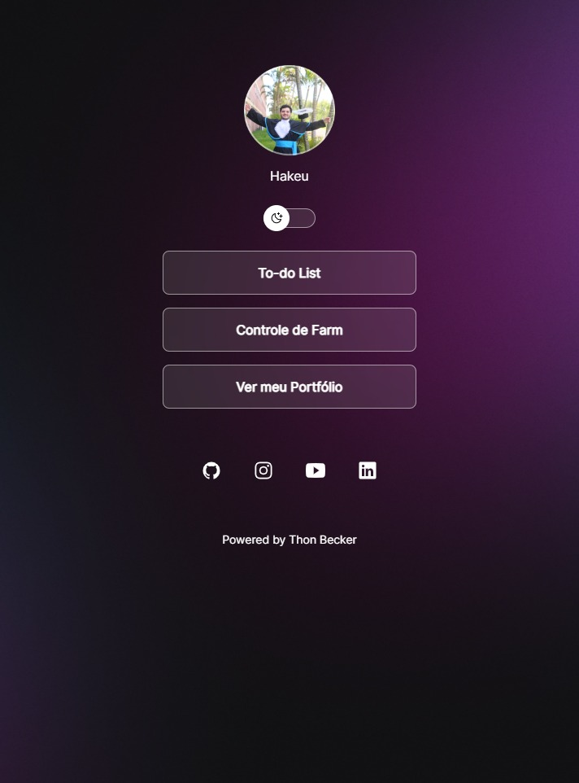

<h1 align="center"> Projeto de estudos </h1>

Projeto desenvolvido a partir do curso Discover da Rocketseat, com foco em revisar e aperfeiçoar conceitos.

  <a href="#-tecnologias">Tecnologias</a>&nbsp;&nbsp;&nbsp;|&nbsp;&nbsp;&nbsp;
  <a href="#-projeto">Projeto</a>&nbsp;&nbsp;&nbsp;|&nbsp;&nbsp;&nbsp;
  <a href="#memo-licença">Licença</a>

  

 

  

## 🚀 Tecnologias

Esse projeto foi desenvolvido com as seguintes tecnologias:

- HTML e CSS
- JavaScript
- Git e Github

## 💻 Projeto

O Projeto se trata de um Hub de links, do qual leva para outros projetos meus, meu portfólio e minhas redes sociais.

## Licença

Esse projeto está sob a licença MIT.

---

Thon#0777
